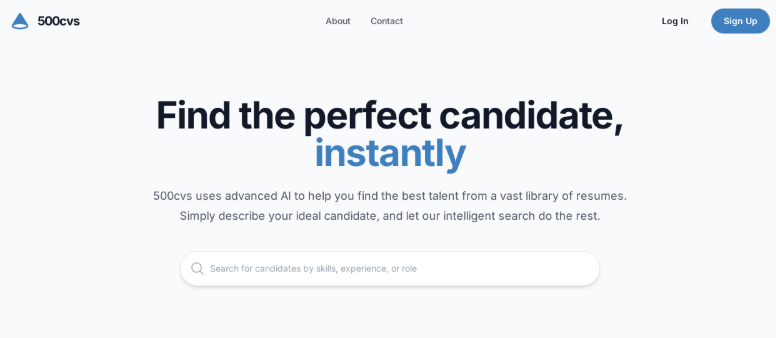
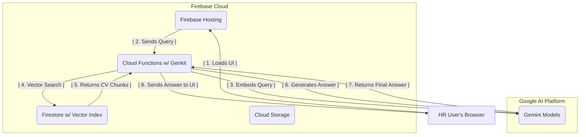
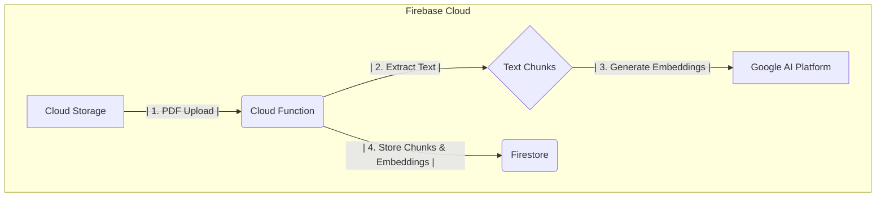
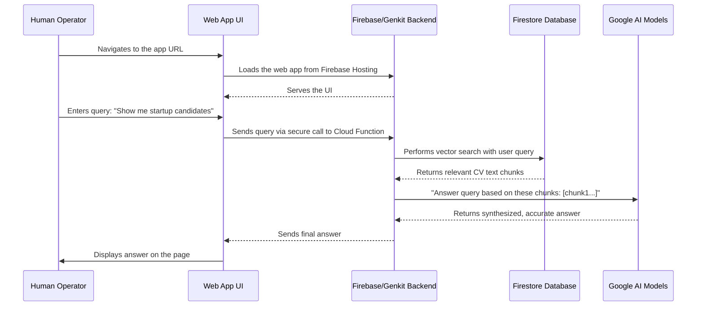

# **AI-Powered CV Screening Application**

A serverless web application that allows HR teams to intelligently search through a library of candidate CVs using natural language queries. This project is designed to be built and deployed automatically by an **agentic AI coder**, ensuring a fast, error-free, and reproducible deployment.



UI by Stitch AI

## **1. The Problem**

An HR department has hundreds of PDF CVs for a recruitment drive. Manually sifting through them to find candidates matching specific, nuanced criteria (e.g., "has worked at a startup," "has leadership experience in a corporate setting") is slow, inefficient, and prone to human error.

## **2. The Solution**

This project creates a **private, secure web tool** that automates the CV screening process. It leverages **Retrieval-Augmented Generation (RAG)** to enable HR operators to have a conversation with their document library. By extracting text from PDFs and vectorizing the content, the system provides fast, accurate, and context-aware answers grounded in the provided CVs.

### **Key Features**
- **Automated PDF Ingestion**: Extracts text from PDFs and makes them instantly searchable.
- **Natural Language Search**: Ask questions like, "Who are the top 3 candidates with experience in B2B SaaS?" instead of just using keywords.
- **Secure & Private**: All data is stored securely in your private Google Cloud project.
- **Serverless & Cost-Effective**: No servers to manage. You only pay for what you use, with a generous free tier.
- **AI-Powered Deployment**: The entire infrastructure and application are set up by an AI agent from a set of instructions.

---

## **3. Tech Stack & Architecture**

This solution is built entirely on the **Google Cloud and Firebase ecosystem**, using the **Genkit AI framework** to simplify development.

| **Component**       | **Technology**                  | **Purpose**                                                                 |
|:--------------------|:--------------------------------|:----------------------------------------------------------------------------|
| **Frontend**        | Firebase Hosting                | Serves the static HTML/JS/CSS for the web UI.                               |
| **Backend**         | Firebase Cloud Functions + Genkit | Orchestrates the AI-powered logic, including embedding generation and RAG. |
| **File Storage**    | Firebase Cloud Storage          | Securely stores the source PDF CVs.                                        |
| **Database**        | Firestore                       | Stores text chunks and vector embeddings for fast semantic search.         |
| **AI Models**       | Google AI Platform (Gemini)     | Powers document embedding and answer generation.                           |

### **System Architecture Diagram**


---

## **4. How It Works**

The system operates in two main phases: data ingestion and querying.

### **Phase 1: Data Ingestion**

When a PDF file is uploaded to the Cloud Storage bucket, a Cloud Function is triggered. This function reads the PDF, extracts the text, splits it into chunks, generates vector embeddings for each chunk, and stores the chunks and their embeddings in Firestore.



### **Phase 2: Live Querying**

When a user enters a query in the web UI, a Cloud Function is called. This function generates an embedding for the query, searches Firestore for the most similar document chunks, and then uses a large language model to generate an answer based on the retrieved chunks.



---

## **5. Local Development**

Here's how to get the project up and running in a few commands without deploying to the cloud useing the Firebase Local Emulator Suite.

1.  **Install Dependencies**:
    ```bash
    npm install
    ```
2.  **Start the Emulators**:
    ```bash
    firebase emulators:start
    ```
    This will start the Firebase Local Emulator Suite (a local version of your backend and frontend), with URLs provided in your terminal. TYou can access the application at the URL provided in the terminal.

3.  **Running Tests**:
    This project does not yet have a test suite. See `ideas_backlog.md` for more information.

4. Deploy to the cloud:**
```bash
# Set your Google Cloud Project ID
export PROJECT_ID="your-chosen-unique-project-id-123"

# Run the deployment script
./02-deploy-and-upload.sh
```

---
## **6. Getting Started: The Agentic Workflow**

This project is designed to be built by an **agentic AI coder**. Your role is to guide the agent by providing it with the technical backlog (`project_backlog.md`).

## How the AI Agent Works

The AI agent reads the `project_backlog.md` file and generates executable shell scripts and code snippets. It automates tasks such as:
- Setting up Firebase infrastructure.
- Writing backend logic for data ingestion and querying.
- Deploying the application to Firebase.

You provide the AI agent with specific prompts (see "Getting Started"), and it executes the corresponding steps in the `project_backlog.md`.

### **Step 1: Prerequisites**
Ensure the following tools are installed and configured on your workstation:
- **Google Cloud SDK (`gcloud`)**: [Install Guide](https://cloud.google.com/sdk/docs/install)
- **Firebase CLI (`firebase-tools`)**: Run `npm install -g firebase-tools`
- **Node.js**: v20 or higher
- Authenticate both CLIs by running:
  ```bash
  gcloud auth login
  firebase login
  ```

### **Step 2: Prepare Your Data**
1.  Clone this repository to your local machine.
2.  Create a folder named `cv_files` in the root of the project directory.
3.  Place all your candidate PDFs inside the `cv_files` folder.

### **Step 3: Instruct Your AI Agent**
Now, command your AI agent to build the project. The agent will read the `project_backlog.md` file and execute the plan defined within it.

---

## **7. Contributing**

Contributions are welcome! If you would like to contribute to this project, please follow these steps:

1.  **Fork the repository.**
2.  **Create a new branch for your feature or bug fix.**
3.  **Make your changes and commit them with a descriptive commit message.**
4.  **Push your changes to your fork.**
5.  **Create a pull request.**

Please see the `ideas_backlog.md` file for a list of potential contributions.

---

## **8. License**

This project is licensed under the **MIT License**. See the `LICENSE` file for details.
